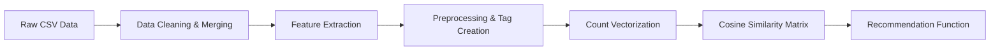

# 🎬 Content-Based Movie Recommender System

## 🚀 Overview

This project solves the problem of **item-to-item recommendation**. Unlike collaborative filtering, which requires user history, this system recommends movies based purely on the content features of the movies themselves.

If a user likes a specific movie (e.g., *Inception*), the system finds other movies that share similar directors, actors, genres, or plot descriptions.

## 📂 Dataset

The project utilizes the **TMDB 5000 Movie Dataset**, which contains metadata for ~5,000 movies.

-   **Source:** [Kaggle - TMDB Movie Metadata](https://www.kaggle.com/datasets/tmdb/tmdb-movie-metadata?resource=download&select=tmdb_5000_movies.csv)
-   **Required Files:**
    1.  `tmdb_5000_movies.csv` (Contains metadata, budget, genres, overview, etc.)
    2.  `tmdb_5000_credits.csv` (Contains cast and crew information)

> **Note:** Ensure you download and place these CSV files in the root directory of the project before running the script.

## 🛠 Tech Stack

| Library | Purpose |
| :--- | :--- |
| **NumPy** | Linear algebra and numerical operations. |
| **Pandas** | Data manipulation, cleaning, and CSV I/O. |
| **Scikit-Learn** | `CountVectorizer` for text vectorization and `cosine_similarity` for calculating recommendation scores. |

---

## ⚙️ Installation & Setup

### 1. Prerequisites
Ensure you have Python 3.8 or higher installed.

### 2. Install Dependencies
Clone the repository and install the required packages:

```bash
git clone https://github.com/your-username/movie-recommender.git
cd movie-recommender
pip install -r requirements.txt
```

> *Note: If a `requirements.txt` does not exist, manually install the libraries:*<br>
> `pip install numpy pandas scikit-learn`

### 3. Configuration
The provided script uses Google Colab file paths (`/content/`). To run locally:

1.  Open `movie_recommender_system.py`.
2.  Modify lines 19-20 to point to your local CSV files:

```python
# Original Colab Paths:
# movies = pd.read_csv('/content/tmdb_5000_movies.csv')
# credits = pd.read_csv('/content/tmdb_5000_credits.csv', engine='python')

# Updated Local Paths:
movies = pd.read_csv('tmdb_5000_movies.csv')
credits = pd.read_csv('tmdb_5000_credits.csv', engine='python')
```

---

## 🧠 How It Works

The recommendation engine follows a structured NLP pipeline:

1.  **Data Merging:** Combines movie metadata (`movies`) with credit information (`credits`) based on the movie title.
2.  **Feature Extraction:**
    *   **Genres & Keywords:** Extracts names from JSON-like stringified columns.
    *   **Cast:** Retrieves the top 3 actors.
    *   **Crew:** Specifically fetches the **Director** name.
3.  **Text Preprocessing:**
    *   Removes spaces between words (e.g., "Science Fiction" → "ScienceFiction"). This prevents the vectorizer from treating "Science" and "Fiction" as separate distinct tags.
    *   Converts the movie `overview` into a list of words.
4.  **Tag Creation:** Concatenates `overview`, `genres`, `keywords`, `cast`, and `crew` into a single master `tags` column.
5.  **Vectorization:** Converts the `tags` into numerical vectors using `CountVectorizer` (limiting to the top 5,000 most frequent words).
6.  **Similarity Calculation:** Computes the **Cosine Similarity** between every movie vector to determine how closely related they are.

---

## 📖 Usage

### Running the Script
Execute the Python file to generate the model artifacts.

```bash
python movie_recommender_system.py
```

This will process the data and generate two binary files:
*   `movie_list.pkl`: The cleaned and processed DataFrame.
*   `similarity.pkl`: The similarity matrix used for predictions.

### Getting Recommendations
The script defines a `recommend(movie_title)` function. You can call this interactively:

```python
def recommend(movie):
    index = new[new['title'] == movie].index[0]
    distances = sorted(list(enumerate(similarity[index])), reverse=True, key=lambda x: x[1])
    for i in distances[1:6]:
        print(new.iloc[i[0]].title)

# Example:
print("Recommendations for 'Avatar':")
recommend('Avatar')
```

**Sample Output:**
```text
Recommendations for 'Avatar':
Aliens
Guardians of the Galaxy
Alien
Star Trek Into Darkness
Moon
```

---

## 📂 Project Structure

```text
.
├── movie_recommender_system.py   # Main Python script
├── README.md                      # Project documentation
├── tmdb_5000_movies.csv           # Dataset (to be added by user)
├── tmdb_5000_credits.csv          # Dataset (to be added by user)
```

## 🔄 Workflow



---
